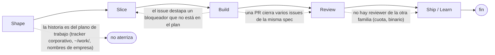

# Flujos de la fábrica

Generado por `npm run flows` desde `skills/wayfinder/stations.json`; no se edita a mano.

## Ramas

| Desde | Cuándo | Adónde | Comando | Skill |
|---|---|---|---|---|
| Shape | la historia es del plano de trabajo (tracker corporativo, ~/work/, nombres de empresa) | *(no aterriza)* | `/buzz-kickoff <spec> (los artefactos quedan en el agente y se aterrizan desde el otro plano)` | `buzz-kickoff` |
| Build | el issue destapa un bloqueador que no está en el plan | Slice | `/to-tickets-linear <equipo> (un issue que bloquea al actual; luego Build sobre el nuevo)` | `to-tickets-linear` |
| Build | una PR cierra varios issues de la misma spec | Review | `gh pr create --base main (Closes <clave> por cada issue, sin rama nueva)` | `build-kickoff` |
| Review | no hay reviewer de la otra familia (cuota, binario) | Ship / Learn | `/learnings <key> (con deuda: anotar el rango sin revisar)` | `adversarial-review` |

## Entradas

| Entrada | Estación | Comando |
|---|---|---|
| idea | Shape | `/buzz-kickoff <spec>` |
| spec | Slice | `/to-tickets-linear <spec>` |
| issue | Build | `/build-kickoff <key>` |
| pr | Review | `/adversarial-review` |
| merged | Ship / Learn | `/learnings <key>` |

## Recorridos

| Trabajo | Estado | Issues | Grill | Learnings |
|---|---|---|---|---|
| [Script npm run stations que imprime la tabla de estaciones con su estado real](specs/anadir-un-script-npm-run.md) | shipped | JAR-5, JAR-8, JAR-6, JAR-7 | [grill](grill/npm-run-stations/verdict.md) | [2026-09-12-npm-11-no-longer-prints-npm-error-on-script-exit](vault/learnings/2026-09-12-npm-11-no-longer-prints-npm-error-on-script-exit.md) |
| [docs/flows.md: el mapa end to end de la fábrica, generado desde stations.json](specs/flujos-end-to-end.md) | sliced | JAR-10, JAR-11 | — | — |
| [Comentarios en las cards de Linear escritos para un humano, y linear.mjs como única puerta al tablero](specs/linear-comentarios-para-humanos.md) | sliced | JAR-16, JAR-17 | [grill](grill/linear-comentarios/gpt-review.md) | — |
| [npm run stations -- --check comprueba que cada proveedor responde y muestra la deuda de Review](specs/stations-check-proveedores-y-review.md) | shipped | JAR-14, JAR-15 | [grill](grill/stations-check-gpt/verdict.md) | [2026-09-12-read-evidence-from-where-the-writer-puts-it](vault/learnings/2026-09-12-read-evidence-from-where-the-writer-puts-it.md) |
| [El wayfinder enruta con las transiciones de stations.json](specs/wayfinder-enruta-con-transitions.md) | sliced | JAR-9 | — | — |
| [El wayfinder entra por Review o Ship según el estado real de la PR en GitHub](specs/wayfinder-estado-de-la-pr-en-github.md) | sliced | JAR-13 | — | — |
| [El wayfinder entra por la estación que dicta el estado del issue en Linear](specs/wayfinder-estado-del-issue-en-linear.md) | sliced | JAR-12 | — | — |

